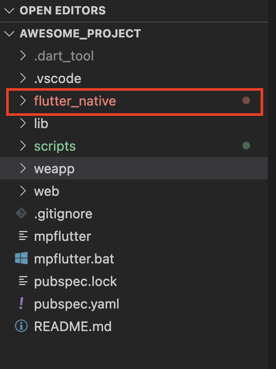

在编写第一个 Flutter Native 应用前，请先按照[《编写第一个 Web 应用
》](/docs/web-first-app)指南创建好 MPFlutter 工程，体验完整的开发流程，并尝试构建一个 Web 应用。

## 初始化 Flutter Native 工程

在[《编写第一个 Web 应用》](/docs/web-first-app)创建的 MPFlutter 工程目录下，使用命令行执行 `dart scripts/help.dart`，在菜单中选择【初始化 Flutter Native 工程】。

```shell
?  (Use arrow keys)
  初始化 MPFlutter 模板工程
  初始化 Android Studio 配置文件
❯ 初始化 Flutter Native 工程
  升级 MPFlutter 核心库
  使用模板创建一个本地扩展
  构建 Web 应用
  构建小程序应用（微信、字节）
  构建 Flutter Native 应用
  退出
```

稍等片刻，程序会告知初始化成功，工程目录下会多出 flutter_native 目录。



`flutter_native` 目录下是一个普通的 flutter 工程，你可以使用命令行进入 `flutter_native` 执行常规的各类 flutter 操作，例如 `flutter packages get`。

你也可以进入 `flutter_native/ios` 和  `flutter_native/android` 目录修入应用的配置，例如图标、签名等信息。

## 运行应用

保持在 VSCode 窗口中，按下键盘【F5】键（也可以使用鼠标点开调试栏启动调试），开始调试。


稍等片刻，调试控制台中会出现以下信息（如果没有出现该信息，请重新启动调试）。


此时，继续使用命令行进入 flutter_native 目录，把这个 Flutter 应用运行到模拟器上。

正常情况下，你应该可以在 iOS 或者安卓模拟器上看到 MPFlutter 应用运行在上面了。

热重载、断点等能力都可以正常使用。

## 真机调试

你需要修改 `flutter_native/lib/mp_config.dart` 文件，将其中的 `127.0.0.1` 替换为你的电脑局域网 IP，例如你的 IP 是 192.168.1.2，则代码如下。

```dart
class MPConfig {
  static const String devServer = "192.168.1.2";
  static const bool dev = true;
}
```

然后再次运行 Flutter 应用就可以了。

## 小结

使用 Flutter 运行 MPFlutter，听上去有点绕？

你只需要把 Flutter 理解成它也是一个小程序就好。
