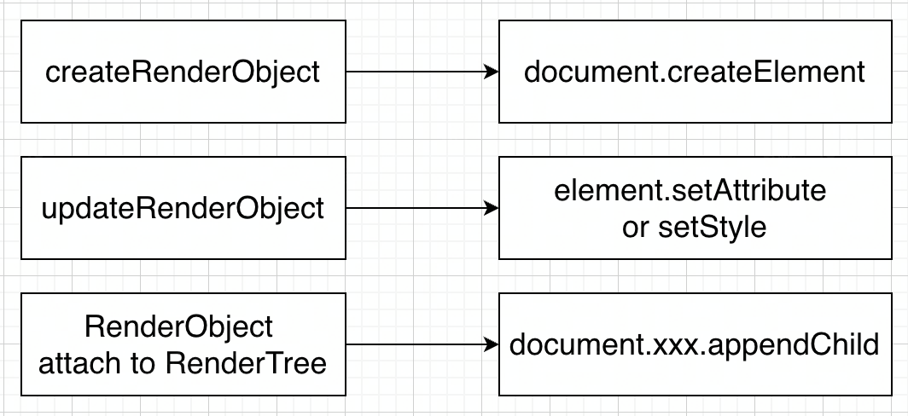

## MPFlutter VS FFW

Flutter 官方是支持开发 Web 应用的，我们称之为 Flutter For Web (FFW)，我们在这里阐述 MPFlutter 与 FFW 的异同点、优缺点，你可以通过本节内容大概了解 MPFlutter 的原理，在方案选型上，你可以有更充分的认识。

### 实现差异（性能）

Flutter For Web 的原理实质是把 Browser DOM 或是 WebAssembly Canvas 当作一块画布使用，在 FFW 方案中，Flutter Framework 层是与 Flutter Native 完全一致的。

可以认为 Flutter Framework 类似游戏引擎，而在游戏引擎上编写逻辑、视图抽象层是与平台无关的，Flutter 会在 Engine 层实现具体渲染。

具体来说，就是你在 Flutter 中创建的每一个 Widget(RenderObject) 都会映射到 DOM 中，而这一步操作在 FFW 中是同步的。

更进一步的，FFW 会接管所有的事件（Touch / KeyPress / Input），也就是说浏览器原有的滑动优化、视图缓存能力都被 FFW 托管了。

举个例子，一个普通的网页，当用户滚动该页面时，一般来说不会造成严重的卡顿问题，因为在这个过程中并没有过多的 Script 开销，浏览器会尽可能在渲染缓存上保证滑动流畅。

而在 FFW 上，由于所有的事件都被托管至 Framework 层，故滑动这一操作也会由 Flutter Framework 控制，简单来说就是页面中的 div 之所以会有滑动的效果，是因为 Flutter Framework 在不断改动页面中的 div css position 属性做到的。

频繁地改动 div css 属性会造成页面重绘、重排，频繁地通过 JS 修改 DOM 也会造成严重的性能问题。

当然使用 WebAssembly Renderer 可以解决这一问题，但在移动端上性能也不是很理想。

MPFlutter 与 FFW 在渲染实现上有较大的差异，MPFlutter 完全移除了 Flutter For Web 的 Renderer 实现。

MPFlutter 是通过在每帧结束时，dump 出整个 Element Tree 的结构，序列化成 JSON 数据，在 Browser 端反序列化并生成对应的 DOM Element 实现的。

实际上，就是以空间换时间。

### 工具链差异

MPFlutter 与 Flutter 是共享同一套工具链的，在 MPFlutter 上开发应用，体验上与 Flutter 并无太大差异，以下能力 MPFlutter 都是支持的：

- 热重载 (Hot Reload)
- 热重启（Hot Restart）
- VSCode IDE 内断点调试
- 完整的 Dart 语言支持

MPFlutter 不支持以下能力：

- 不支持 import dart:ui 库
- 不支持 material 库（裁掉了）
- 大部分 pub 插件是不支持的（由 mpflutter 官方提供扩展）

### 产物差异

MPFlutter 的最终产物也是通过 dart2js 生成的 main.dart.js 包。

相比 Flutter 的起始应用大小，2M 左右的初始尺寸，MPFlutter 的起始应用大小仅为 427K。
