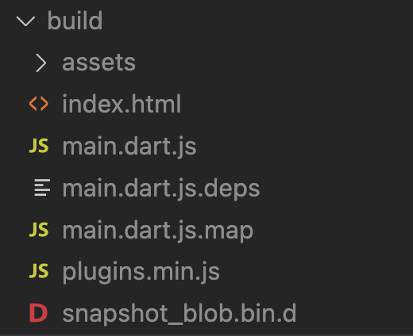

如果你的应用已经开发完成，可以使用以下方法构建最终产物。

使用命令行，定位到工程目录，输入以下命令。

```sh
> dart scripts/build_web.dart
```

稍等片刻，便会出现以下提示。

```sh
正在构建...
构建成功，产物位于 build 目录。
```

此时，Web 应用产物就在 build 目录下。



如果你需要在本地访问产物，最简单的方式是定位到 build 目录下，执行以下命令。

```sh
npx http-server
```

然后，你就可以在命令行的提示中看到 URL，并用浏览器访问了。